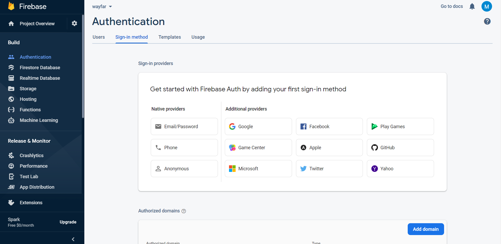

# Firebase

## Create a Firebase project

Since the app uses some features of firebase such as authentication and push notifications, you have to register it in firebase console.

Head over to [Firebase Console](https://console.firebase.google.com) (Create an account if you don't have one), and click on Add Project in the console home page.

 

Enter the application name, follow the steps and submit. You'll be redirected to the project home page afterwards.


Now, it's time to register the app, it's different depending on what platform you want to run the app:&#x20;

## Register an <mark style="color:green;">Android</mark> app

For Android, you can register the app by clicking on the Android Icon button bellow "Get started by adding Firebase to your app" in the project home page. You will be requested to enter the package name and signing certificate.

For the package name, you must use the one that has been set on [Android configuration](android.md#app-configuration) step, and for the signing certificate SHA-1 you can obtain it by running the command bellow:

```bash
gradlew signingreport
```


The next step is to download the config file `google-services.json` and place it the folder `[project]/android/app`



You can **skip** the third and fourth step, since the firebase sdk is already configured in the project.


## Register an <mark style="color:blue;">iOS</mark> app

Coming soon (the application is under test for iOS platform)

## Configure authentication

In this app, the user can authenticate using a username or a password or by using one of the following sign-in providers:

#### Google

To activate the Google sign-in provider, head over **Authentication** menu item in the firebase console, under the tab **Sign-in method**, click on **Add new provider** and select Google.

Enable the switch and click on save.

 

#### Facebook

To activate the Facebook sign-in provider, You should first register a Facebook app, head over to [Facebook developers](https://developers.facebook.com/docs/development/register/) platform, and follow the guide.&#x20;

After registering a Facebook app, head over **Authentication** menu item in the firebase console, under the tab **Sign-in method**, click on **Add new provider** and select Facebook.

Enter the **App ID** and **App Secret** of your registered Facebook app, enable the switch and click on save.


#### Twitter

To activate the Twitter sign-in provider, You should first register a Twitter app, head over to [Twitter developers](https://developer.twitter.com/apps) platform, and follow the guide (you have to sign in first).

After registering a Twitter app, head over **Authentication** menu item in the firebase console, under the tab **Sign-in method**, click on **Add new provider** and select Twitter.

Enter the **API Key** and **API secret** of your registered Twitter app, enable the switch and click on save.


## Test push notifications

Push notifications feature is already configured in the app, if you completed the previous steps correctly you should be able to test it.

Head over **Cloud Messaging** menu item, and click on "Send your first message". Fill the notification title and message and on "Send test message" to receive it.

  


Notifications are categorized in the app, to specify the category, add a custom category field in step 5 (Additional options), bellow Custom Data add the key "**category**" having the value : **0** for Important, **1** for Promotion, **2** for Uncategorized. (See the images above)

