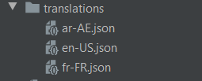

# Internationalization

WayFar template integrates `easy_localization`  package that enables localization feature and right to left support. ([https://pub.dev/packages/easy\_localization](https://pub.dev/packages/easy\_localization))

### Configuration

To support a new locale, head over to the file `locales.dart` under the folder `lib/core/localization` and use `AppLanguage` class to configure the language:


```dart
final languages = [
  AppLanguage("en","US","English", isDefault: true),
  AppLanguage("fr","FR","French"),
  AppLanguage("ar","AE","العربية"),
  //Add languages here 
  // AppLanguage(languageCode, countryCode, displayName, isDefault)
];
```


### Translations resources

Once the configuration is done, you have to add the corresponding resource file in the folder `lib/translations`:



The file naming must respect this format : **\[languageCode]-\[countryCode].json**

### **Translate**

To translate text use the main function **`tr()`** :

```dart
Text('title').tr() //Text widget

print('title'.tr()); //String

var title = tr('title') //Static function
```


**easy\_localization** package has also advances usages, visit the [official doc](https://pub.dev/packages/easy\_localization) to see more.

