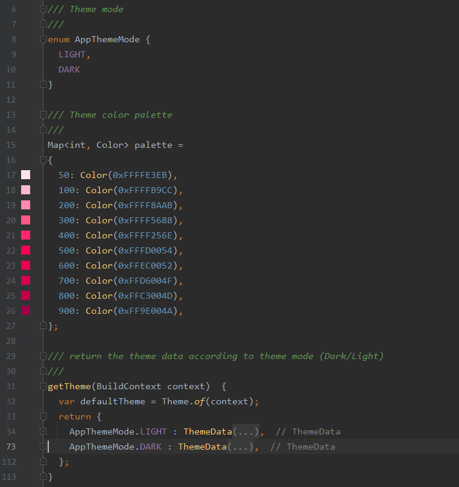

# Theme and fonts

To customize the application theme, head over to the file `theme.dart` under the folder `lib/core/theme/`



#### Theme mode

Currently, there are two theme mode : **dark** and **light.** You are free to add other modes by editing `AppThemeMode` variable.

To switch between the theme modes, you have to use the theme bloc (`theme_bloc.dart`) :

```dart
resolve<ThemeBloc>().setThemeMode(AppThemeMode.DARK);
```

#### Palette

You can change the color scheme used by the app, by customizing another palette.

#### Fonts

The app integrates [GoogleFonts](https://pub.dev/packages/google\_fonts) package, so there is already a large number ready to use integrated into the app. To change the font override the `textTheme` property in `ThemeData` and use one of the text themes available in google fonts:


```dart
ThemeData(
    ...
    textTheme: GoogleFonts.poppinsTextTheme(...),
    ...)
```


#### Extra properties

In the case you need extra properties such as spacing or custom colors, to include into theme data, you can use the extension `AdvancedThemeData`


```dart
extension AdvancedThemeData on ThemeData{
  //TODO declare custom properties here
  EdgeInsets get spacing1x {
    return EdgeInsets.all(4);
  }
  ...
  }
```

